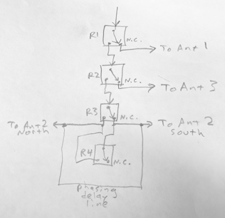

# antennaduino
Arduino-based control box for remote antenna switch

## Overview

This arduino code runs in a control box that switches antennas at a remote point on the roof.

The control box has six buttons, each with an LED, and four relays that switch the corresponding four relays in the remote switch. The possible settings are:

* Antenna 1 &mdash; No relays energized; default setting on startup or selected by pressing button 1.
* Antenna 2 north &mdash; R1 and R2 are energized, selecting  the phased pair directed north.
* Antenna 2 omni &mdash; R1, R2, and R4 are energized (R3 doesn't matter), selecting the pair fed in phase.
* Antenna 2 south &mdash; R1, R2, and R3 are energized, selecting the phased pair directed south.
* Antenna 3 &mdash; R1 is energized.

The setting is selected by pressing the appropriate button, which illuminates in a modified radiobutton scheme.

## Physical housing

This is the initial build of the controller box:

 

The Arduino reads the buttons, sets the LEDs, and controls the adjacent relays. These four relays in turn control 12v lines that run to the remote box to actuate the corresponding four relays there.

## Button actuation

Pressing any of the buttons generates an interrupt, which is handled as follows:

Press button | Light LEDs | Energize relays
-------------|------------|----------------
1 | 1 | (none)
2 | 2 and the last selected of 4/5/6 | R1, R2, conditionally R3, R4 as last selected
3 | 3 | R1
4 | 2 and 4 | R1, R2
5 | 2 and 5 | R1, R2, R3, R4
6 | 2 and 6 | R1, R2, R3

## Effect of relays in the antenna switch

The relays in the remote switchbox mimic the settings of those in the control box. This has the effect of switching the antenna thus:

* R1 selects Antenna 1 or not
* R2 selects Antenna 3 or not
* R3 selects which element of Antenna 2 array is fed leading
* R4 shorts the delay line out of action, causing a generally omnidirectional, somewhat broadside field

Note that Antenna 2 is a vertical pair spaced 90° apart; the 90° phasing line creates a cardioid field strength in the direction of the lagging element.
